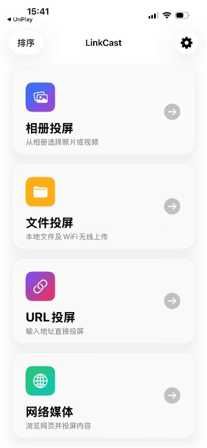

# LinkCast
DLNA客户端是一款强大的投屏工具，能够轻松将本地的图片、视频、音乐等内容投射到其他设备，实现便捷的媒体共享与播放。

# 软件特点
1. 首页卡片排序, 方便用户快捷操作
2. 连续投屏功能, 让你投屏一览无余
3. 幻灯片投屏带, 来更好的体验
4. 记住DLNA服务器, 快速连接，省去重复操作的麻烦

LinkCast 让媒体共享和播放变得前所未有的简单，提供流畅高效的投屏体验。

# 预览图

