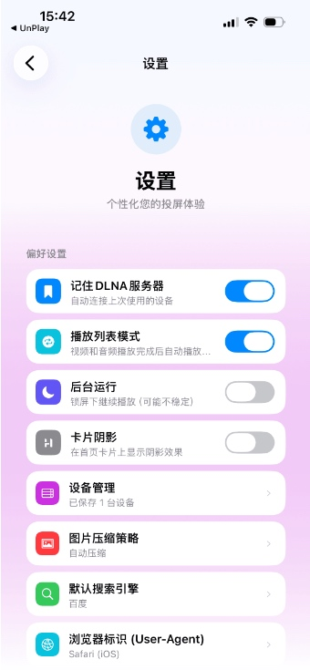
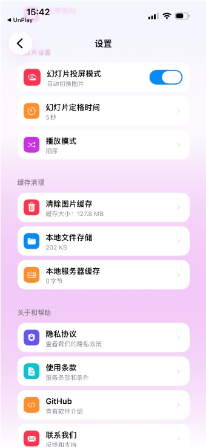
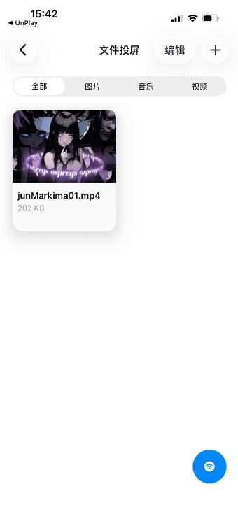
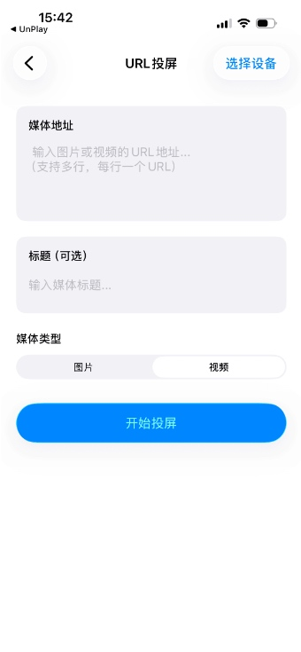
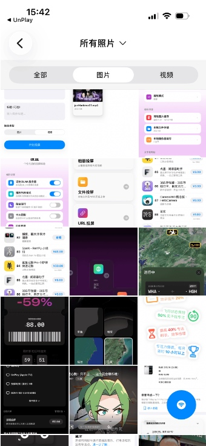

# OpnexCast

**一款把创作与投屏融为一体的全能投屏工具**

集 **涂鸦画板、浏览器、本地相册与视频投屏** 于一身，  
让内容从屏幕到大屏，始终流畅自然。

 

 

### ✨ 全屏 · 实时 · 稳定  
### **让媒体共享、展示与播放，通过全屏实时投屏变得前所未有的简单**

---

## 🚀 核心亮点

- 🎨 **随画随投（AirPlay）**：涂鸦画板实时镜像到大屏  
- 🌐 **浏览器即投（AirPlay）**：Safari 网页全屏镜像展示  
- 🖥️ **真正的全屏镜像**：深度适配 AirPlay / Apple TV  
- 🖼️ **相册投屏（DLNA）**：照片与视频连续全屏播放  
- 🔗 **URL 投屏（DLNA）**：稳定不中断的媒体播放体验  
- ⚡ **高效操作体验**：卡片化首页、DLNA 设备记忆与快速连接  

---

## 🧩 软件特点

### 1) 🎨 随画随投（AirPlay 实时镜像）
在涂鸦画板上自由创作，内容通过 **AirPlay 实时全屏镜像到大屏**，  
所见即所投，适合讲解、教学与灵感展示。

### 2) 🌐 浏览器即投（Safari / AirPlay）
支持 **Safari AirPlay 镜像**，网页内容全屏呈现，  
无需额外操作，演示与分享更自然。

### 3) 🖥️ 真正的全屏镜像体验
深度适配 **AirPlay 与 Apple TV**，  
画面不裁切、不变形，大屏显示更沉浸。

### 4) 🖼️ 相册全屏投屏（DLNA）
通过 **DLNA 协议** 将本地照片与视频投屏到大屏，  
支持连续播放，适合相册展示与家庭分享。

### 5) 🔗 URL 连续投屏（DLNA）
基于 **DLNA 协议** 的 URL 投屏方案，  
播放稳定不中断，观看过程更从容。

### 6) ⚡ 更高效的操作体验
- 🧱 **首页卡片式布局**：常用功能优先展示，一触即达  
- 🖼️ **DLNA 幻灯片连续投屏**：相册与媒体展示更流畅  
- 📡 **记住常用 DLNA 设备**：快速连接，省去重复设置  

---

## ✅ 适用场景

- ✏️ 实时涂鸦讲解 / 教学演示  
- 🌐 Safari 网页内容全屏展示  
- 🏠 家庭照片与视频分享（DLNA）  
- 💼 会议演示 / URL 媒体投屏  
- 📺 DLNA 设备连续播放场景  

---

## 📌 关键词

`AirPlay` · `Apple TV` · `DLNA` · `Photo Casting` · `Browser Mirroring` · `URL Casting`

---

**OpnexCast**  
让创作与展示，自然地登上大屏。

# 预览图

